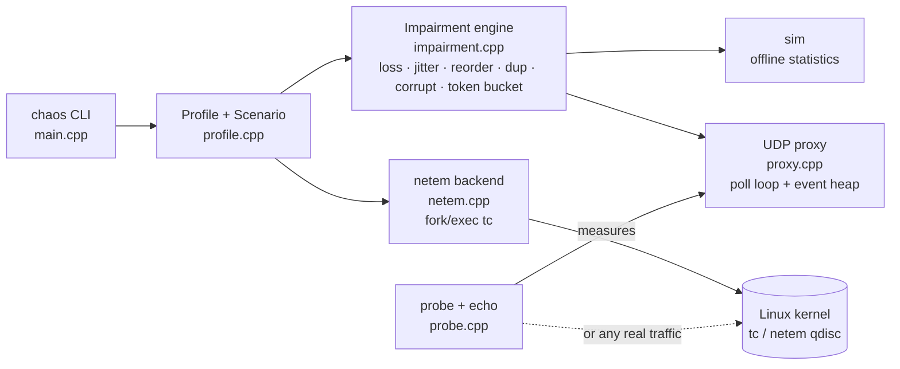

# chaos — Network Latency & Packet-Loss Chaos Emulator

A C++17 chaos-engineering tool for Linux that makes a healthy network behave like a bad one — **with its own
impairment engine, two enforcement backends, built-in measurement, and safety rails** — so you can test how software
copes with latency, jitter, bursty packet loss, reordering, duplication, corruption and bandwidth limits.

Most tools in this space are a thin wrapper around `tc netem`. This project **implements the impairment models itself**
(Gilbert-Elliott burst loss, token-bucket shaper, jitter distributions), proves them against theory, and can *also*
drive the kernel's netem from the same profile definitions.

## What makes it different

| | |
|---|---|
| **Own impairment engine** | Pure, seeded, deterministic C++ core (`impairment.cpp`): Bernoulli + Gilbert-Elliott burst loss, uniform/normal jitter, reordering, duplication, corruption, token-bucket shaper with tail-drop. No sockets, no clock → unit-testable and reproducible. |
| **Two backends, one profile format** | **Userspace UDP proxy** (epoll-style `poll` event loop, scheduled-delivery heap; *no root needed*) and **kernel `tc netem`** (fork/exec, no shell). Same `Profile` drives both. |
| **Verifies itself** | Built-in `probe` + `echo` measure RTT percentiles, RFC 3550 jitter, loss, duplicates, reordering and payload corruption — so every claim ("20% loss") is *measured*, not assumed. |
| **Time-based scenarios** | `at 30 loss=12 delay=450` timelines: simulate a link degrading, a tunnel blackout, recovery. |
| **Safety engineering** | Dead-man TTL auto-revert, signal-safe cleanup (SIGINT/SIGTERM/SIGHUP), SSH lock-out guard, interface whitelist, no `system()`, `--dry-run`, isolated namespace lab. |
| **Engineering rigor** | 69 unit checks vs closed-form theory, end-to-end tests over real sockets, ASan/UBSan clean, `-Wall -Wextra -Wpedantic` clean, CI matrix. |

## Architecture



## Build and run

```bash
sudo apt update && sudo apt install -y g++ make iproute2 iputils-ping
make            # builds ./chaos, zero warnings
make check      # unit tests + end-to-end tests
```

### 1. Preview a profile offline (no root, no network)
```bash
./chaos profiles
./chaos sim --profile 3g --packets 50000 --pps 100 --size 1200
```
```
Loss    : 1.05%   mean burst=1.00 pkts   longest burst=2
Delay ms: min 0.00  avg 150.06  p50 150.04  p95 216.22  p99 242.83  max 323.63
Jitter  : 45.02 ms (mean |delta delay|)   reordered arrivals=33220
Goodput : 949.61 kbit/s
```
Same average loss (~6.3 %), very different *shape* — this is why a burst model matters (TCP and video behave very
differently under bursts):
```
burst-loss(p=2% r=30%) : loss 6.39%  mean burst 3.35 pkts  longest burst 24
random loss=6.25%      : loss 6.21%  mean burst 1.07 pkts  longest burst 4
```

### 2. Userspace proxy — safe, no root (3 terminals)
```bash
./chaos echo  --port 9000                                              # a stand-in "server"
./chaos proxy --listen 9001 --target 127.0.0.1:9000 --profile lossy-wifi --stats 5
./chaos probe --target 127.0.0.1:9001 --count 200 --interval 20 --timeline
```
Point any UDP application (DNS client, game, VoIP test, your own service) at port 9001 instead of the real server.
Each client gets its own upstream socket; sockets of clients idle for `--idle SEC` (default 60, `0` = never) are released,
and if the process runs out of file descriptors the least-recently-used client is evicted, so the proxy keeps serving new clients.

### 3. Scenario: a link that degrades and recovers
```bash
./chaos proxy --listen 9001 --target 127.0.0.1:9000 --scenario scenarios/degrading-link.chaos
./chaos probe --target 127.0.0.1:9001 --count 600 --interval 100 --timeline   # watch RTT/loss follow the timeline
```
Measured example (`tests/e2e_proxy.sh`, step to 100 ms-each-way at ~1.5 s):
```
t=0s  sent=40  loss=0.0%  avg RTT=0.1 ms
t=1s  sent=40  loss=0.0%  avg RTT=98.1 ms   <- step lands mid-second
t=2s  sent=20  loss=0.0%  avg RTT=201.3 ms
```

### 4. Kernel backend (real interfaces, needs root)
```bash
./chaos netem apply --dev eth0 --profile lossy-wifi --ttl 30 --dry-run    # preview exact tc command
sudo ./chaos netem apply --dev veth-a --profile 3g --ttl 30               # auto-reverts after 30 s or Ctrl+C
sudo ./chaos netem show --dev veth-a
sudo ./chaos netem scenario --dev veth-a --file scenarios/degrading-link.chaos
```
`sudo scripts/lab.sh demo` builds two network namespaces joined by a veth pair so you can try the kernel backend
with **zero risk** to your real connection.

## Profiles and parameters

Presets: `none lte 3g edge-2g satellite lossy-wifi congested blackhole`. Override any value with `--set key=value`.
Unknown options, stray arguments and out-of-range numbers are rejected with an error (a mistyped `--profle` never
silently runs without impairment). `chaos <command> --help` prints usage.

`delay jitter` (ms) · `dist` (uniform|normal) · `loss dup corrupt reorder` (%) · `rate` (kbit/s) ·
`ge_p ge_r ge_bad ge_good` (% Gilbert-Elliott) · `burst` (bytes) · `queue` (ms)

## How it works (the parts worth explaining)

- **Impairment engine.** `process(t, size)` maps one arriving packet to zero or more departure times. Loss first
  (Gilbert-Elliott two-state Markov chain, then independent loss), then the token-bucket shaper, then reordering/delay,
  then duplication/corruption. Steady-state burst loss is `p/(p+r)` and mean burst length `1/r` — the unit tests check
  the simulation against exactly these formulas.
- **Token bucket with "debt".** Tokens may go negative; the debt divided by the rate is how long the packet must wait.
  If that wait exceeds `queue_ms` the packet is tail-dropped. This gives both shaping (delay) and policing (drop) behaviour.
- **Userspace proxy.** One thread, `poll()` with a timeout computed from the earliest due event in a min-heap, so
  delayed packets are released at the right moment without busy-waiting or a thread per packet. Bounded memory
  (queue cap), per-client upstream sockets, bidirectional impairment.
- **Kernel backend.** Builds `tc qdisc replace ... netem ...` and runs it via `fork`/`execvp` (never a shell), so
  an interface name like `eth0; rm -rf /` cannot do anything. A TTL "dead-man switch" removes the qdisc even if you
  forget; signal handlers do the same on Ctrl+C/terminal close.
- **Probe.** Each packet carries a sequence number, timestamp and a deterministic payload pattern, so the receiver
  can distinguish loss, duplication, reordering and *corruption* and compute RTT percentiles and RFC 3550 jitter.

## Testing

```bash
make test    # 69 checks: statistics vs theory, shaper drain time, parsing, netem command strings, injection resistance
make e2e     # real sockets: probe -> proxy -> echo; asserts measured latency, loss, duplication, scenario step
make cli    # option/number validation + proxy robustness regressions (target down, socket recycling)
make check   # all three
```
Also run clean under `-fsanitize=address,undefined` (this caught and fixed a real use-after-scope bug in the
argument parser during development).

## Limitations (honest list)

- The **userspace proxy handles UDP only** and sits in the data path of traffic you point at it; the **kernel backend
  impairs all egress traffic** on an interface (netem is egress-only; ingress would need an IFB device).
- `burst` and `queue` are modelled by the userspace engine; the kernel backend uses netem's own `rate`/`limit`.
- Delay/loss accuracy of the proxy is bounded by `poll()` granularity (~1 ms) and scheduler jitter.
- The kernel-backend commands are unit-tested as strings, `--dry-run` previewable, and accepted by `tc`'s own argument
  parser; applying them needs root, `tc` and the `sch_netem` kernel module (some minimal/container kernels lack it, in
  which case `scripts/lab.sh demo` now says so instead of reporting success) — validate on your own VM.

## Roadmap

TUN/TAP or NFQUEUE mode to impair arbitrary TCP/UDP flows in userspace · ingress via IFB · Prometheus metrics ·
firewall-style selectors (impair only a port/IP via `tc filter` or nftables marks) · ramp scenarios
(`loss=0:20 over 60s`) · reproducible "chaos run" reports.

## Layout

```
src/profile.*      profiles, presets, scenario parser        src/netem.*     kernel tc/netem backend + safety
src/impairment.*   the impairment engine                     src/probe.*     echo server + measuring client
src/sim.*          offline statistical simulator             src/main.cpp    CLI
src/proxy.*        userspace UDP impairment proxy            tests/ scenarios/ scripts/ docs/
```
